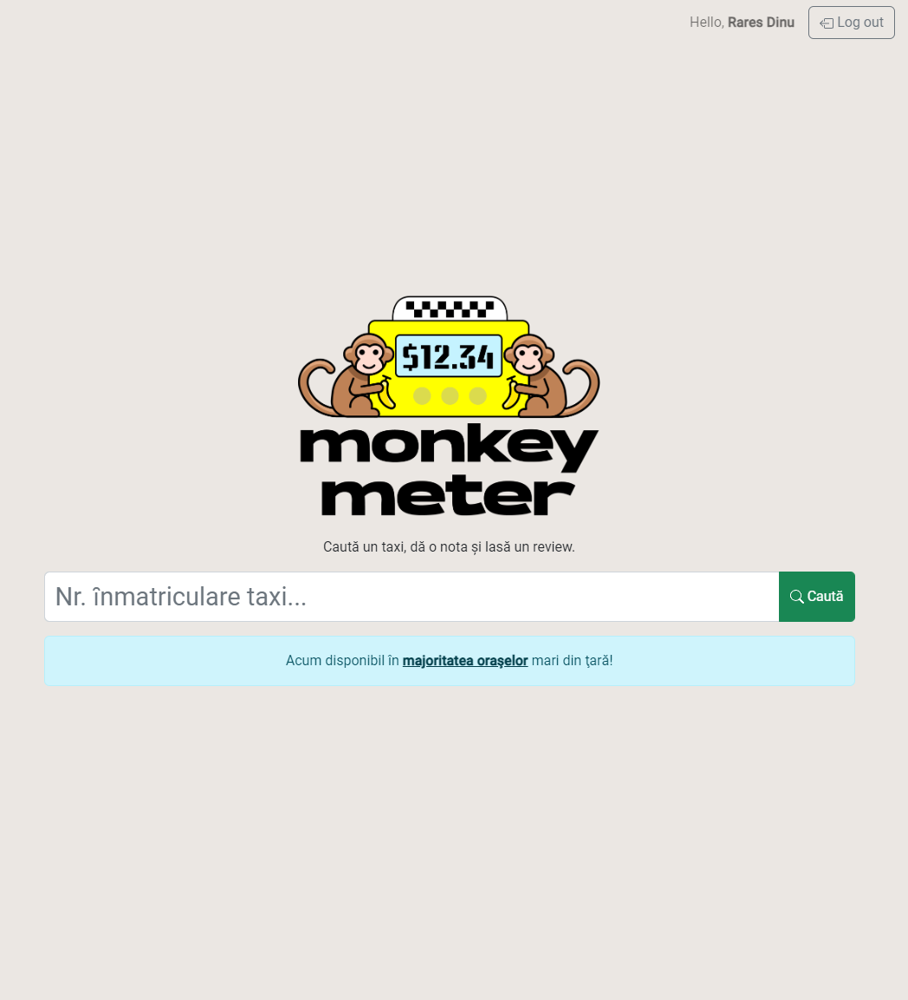
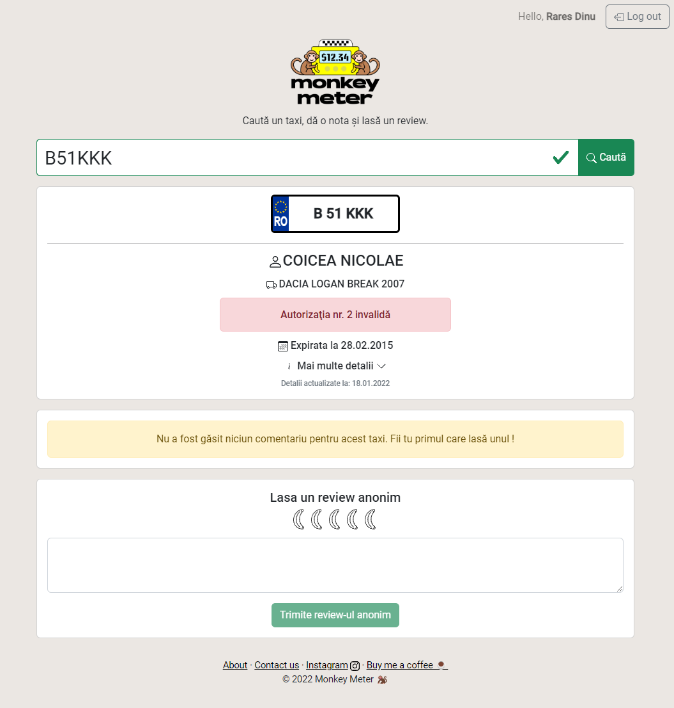

Welcome to [Monkey Meter](https://monkeymeter.ro), the innovative web application I've developed to empower taxi users in Romania by enabling them to review and assess their taxi experiences.

## Background
In today's era of ride-sharing giants like Uber and Bolt, rating your taxi experience has become commonplace. However, for traditional yellow taxis, this convenience has been notably absent. In Romania, especially in cities like Bucharest, traditional taxis have often garnered a bad reputation for subpar conditions and occasional overcharging, leaving customers frustrated and unsure of what to expect.

## Features

With Monkey Meter, we're changing the game. Not only can users leave a review but they can also see the score of a taxi car and read other people's reviews to make sure the car they get into will be safe and will provide them with a good service.

The process is simple: just enter the taxi's registration number, and you'll gain access to all available details about the taxi and its driver. 

*The Monkey Meter home page*

On top of the user submitted reviews and score, the information available on the app often contains the make and model of the car and other technical details but most importantly it informs the user whether or not the taxi driver has a valid taxi authorisation. This will help users make sure they choose an appropriate transport option to meet their needs.

*An example of the Monkey Meter taxi page*

## Data
The data available on the website has been aggregated from multiple official sources and we're dedicated to keep it as up to date as possible. Currently, Monkey Meter has a database of almost 30.000 Romanian taxis which is to my knowledge the largest database of this kind of data in the country.

At the moment, on Monkey Meter, users can rate taxis from most major Romanian cities. These include: Arad, Bacau, Baia Mare, Braila, Brasov, Bucuresti, Buzau, Cluj, Constanta, Craiova, Iasi, Oradea, Pitesti, Ploiesti, Ramnicu Valcea, Sibiu, Suceava and Targu Jiu.

## Conclusion
In conclusion, Monkey Meter fills a previously unmet need in the Romanian taxi industry, giving traditional taxi customers the platform to voice their experiences.

Visit [Monkey Meter](https://monkeymeter.ro) today to access essential information for choosing a safe and reliable transportation option. Our service is available in most major Romanian cities, ensuring you have the tools you need while traveling. Don't forget to bookmark our website for your next taxi ride!

Make your next taxi ride in Romania a hassle-free experience with Monkey Meter.

