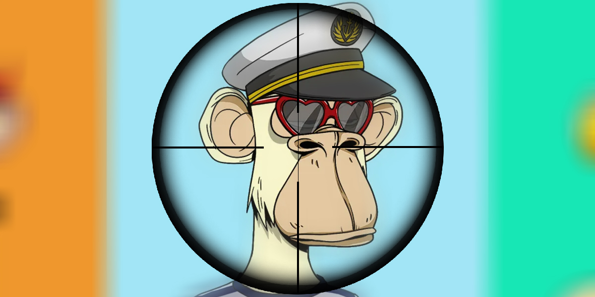
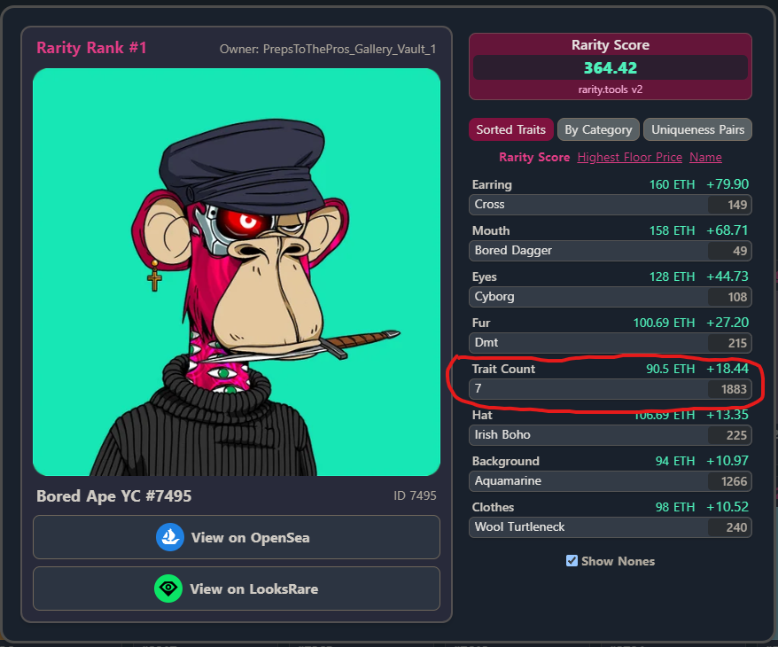
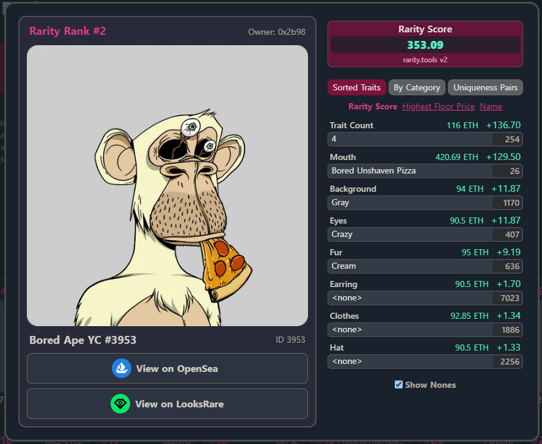
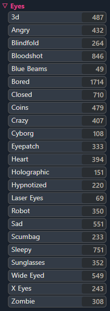
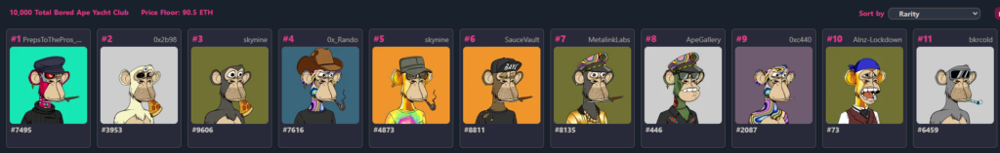
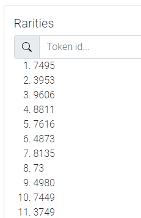

I\'m going to assume you know what an NFT is by now and if not I am sure there are countless posts and videos out there explaining them or making fun of them.

I got into the NFT space not too long ago and immediately I started noticing that some people who had more experience in this space were using a whole bunch of tools to help them gain a (fair or unfair) advantage over the average trader. These were things like free or paid websites to get accurate real time statistics or even advanced bots to buy NFTs on launch before anyone else got a chance.

But going back to the title of this article, what exactly is NFT rarity sniping? Well, if we take terms separately, the rarity of an NFT is basically the average rarity of all of its traits (for example eye color, hair color, etc.). Some traits are rarer than others and usually the NFTs with the rarest traits are more desirable. Sniping in this context refers to finding something before anyone else, or just before other people catch on. So, *NFT rarity sniping is finding and buying rare NFTs before other traders even find out the rarity of their NFTs*.

But how is this possible? To understand this you need to understand the usual release process of an NFT collection. In most cases, after all the items in the NFT collection have been minted the metadata will be revealed. The metadata are the traits and images of the NFTs.

Well, my friend who had been in the NFT space for a while told me about this short window of time right after the traits of an NFT collection are revealed and before the metadata is updated on markets such as OpenSea. In this window of time fast bots or scripts could use get the metadata from the smart contract and calculate the rarities allowing you to get a deal on any rare NFTs listed for sale by unknowing traders. So we started working on a script like this.

The script basically has two main functionalities: getting all the metadata for the collection and calculating the rarities of the NFTs.

### Getting the metadata

To get the metadata we first need to get one of the `tokenUris` from the contract and then loop through all tokens in the collection. Most of the time the tokens are sequential but not always. If they are not sequential we need to use another function in the contract to get the `tokenUri` of the token we need, usually called `getTokenByIndex`. The metadata can be provided in a few different ways but the most common (that I have found) seem to be:

- **IPFS** - Example contract: [Bored Ape Yacht Club](https://etherscan.io/address/0xbc4ca0eda7647a8ab7c2061c2e118a18a936f13d#readContract)
- **JSON API** - Example contract: [WZRD](https://etherscan.io/address/0xe5e771bc685c5a89710131919c616c361ff001c6#readContract)
- **Base64 encoded** (in contract) - Example contract: [Neo Tokyo Indentities](https://etherscan.io/address/0x86357a19e5537a8fba9a004e555713bc943a66c0#readContract)

The main challenges here come from:

- Making sure all the metadata has been fetched
  - This can be tricky because your requests may fail or be very slow if the API is in high demand
- Supporting all metadata types and their variations
- Handling non-sequential token ids
- Doing this as quickly as possible (e.g. using async requests or multi-threading)

Once we are sure we have all the metadata we can move on to the next step.

### Calculating the rarities

Before we get started it might make sense to explain a few terms that I am going to use.

`trait` - refers to an attribute of an NFT, e.g. *Eye Color*
`trait value` - refers to the value of that attribute, e.g. *blue eyes*
`total supply` - the total number of NFTs in that collection

There are a few different ways to calculate the rarity of an NFT but for the most basic one we would just need to calculate how rare every trait value in the collection is (by dividing the number of NFTs that have that trait value by the total supply) and then for each NFT add or multiply the rarities of its traits together to get a rarity score. So something like: `rarityScore += [number of items with that trait value] / [total number of items in the collection]`. Then we would rank the NFTs based on this score.

However, there\'s no need to reinvent the wheel. One of the most popular rarity ranking websites, rarity.tools, have released an article explaining the formula they use to calculate rarity. You can find that article (which I do recommend you read) [here](https://raritytools.medium.com/ranking-rarity-understanding-rarity-calculation-methods-86ceaeb9b98c). But, to summarise, this is the formula that the article proposes:

- - - - - -

> [Rarity Score for a Trait Value] = 1 / ([Number of Items with that Trait Value] / [Total Number of Items in Collection])
> 
> *The total Rarity Score for an NFT is the sum of the Rarity Score of all of it’s trait values.*
> 
> [rarity.tools Medium Article](https://raritytools.medium.com/ranking-rarity-understanding-rarity-calculation-methods-86ceaeb9b98c)

- - - - - -

So the rarity score of an NFT would be the sum of the rarity score for each of its trait values calculated as above. This makes sense and produces pretty good rankings. However, I noticed they did not quite match the ones on the rarity.tools website. One reason for that was that the website also used the number of traits an NFT had as a trait itself and this trait count factored into the rarity calculation. To count the number of traits an NFT has we need to exclude the traits that have a null, undefined or empty string value and only count the ones that are populated.

*Trait count used as an extra trait on rarity.tools*

I\'ve added this but still the rankings don\'t quite match. One other difference that I found is *trait normalisation*.

To apply trait normalization to a trait rarity score means to multiply the statistical rarity of each trait (basically the rarity score from the article) with its mean rarity. So the score would then become: `traitRarityScore = traitStatisticalRarity * traitMeanRarity`

To recap:

`rarityScore` - will be the final rarity score of the NFT

`traitRarityScore `- is the the score of one of the traits of the NFT

`traitStatisticalRarity` - is the one from the article (basically the total number of NFTs that have that trait divided by the total supply)

`traitMeanRarity` - how rare is this trait value (e.g. if we are talking about an Eye Color trait and it can have the following values: blue eyes, green eyes, brown eyes, the mean rarity of Eye Color is 1/3 because there are 3 possible values)

For an actual example, let\'s take [this Bored Ape](https://rarity.tools/boredapeyachtclub/view/3953) below. I\'ll just show the calculation for one of the traits but all of them will follow this same pattern.

*Bored Ape Example*

For the `Eyes` trait there 407 NFTs with `Crazy eyes` and there are 10K NFTs in the collection so the `traitStatisticalRarity` will be `1 / (407 / 10000) = 24.57` (aprox. according to the rarity tools formula from the article).

The Eyes trait has 23 possible values (as we can see from the image below) so the `traitMeanRarity` will be `1/23 = 0.04`.

*All possible values for the Eyes trait*

So, the `traitRarityScore` will be `0.04 * 24.57` = `0.98` . To calculate the **final rarity score** for this NFT we need to do the same calculation for all of the traits of this NFT and add these together, like `rarityScore += `traitRarityScore`` or in this instance `rarityScore += 0.98`.

You can see below that, although it\'s nowhere near as fancy, my script produces the same ranks for the Bored Ape Yacht club collection. Well, almost, 8 out 11 are there and I think that\'s pretty good. My script currently doesn\'t account for NFTs that have the exact same score and just ranks them from 1 to 10000 but I don\'t think that would\'ve made a difference in this case.

*Top 11 rarest apes on rarity.tools*

*Top 11 rarest apes on my own script*

#### Additions

To make the script even more useful you could then make use of the OpenSea API to check if these top ranked NFTs are listed for sale and for what price. If you spot any deals you could quickly go and buy these and you should be able to flip them for $$$.

### Conclusion

So there you go, all you have to do now is put this whole algorithm into a super fast script and run it in that tiny window of time after the metadata is released and before other buyers catch on. It\'s definitely a challenging task but it is potentially very rewarding. Obviously, you will be competing with other scripts and websites that already do this so the window of opportunity is even smaller but there is always a chance!
